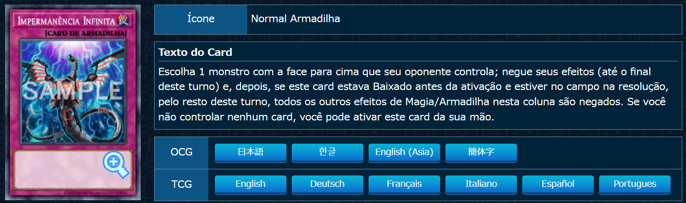
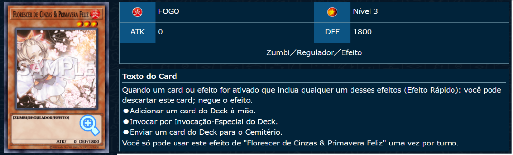
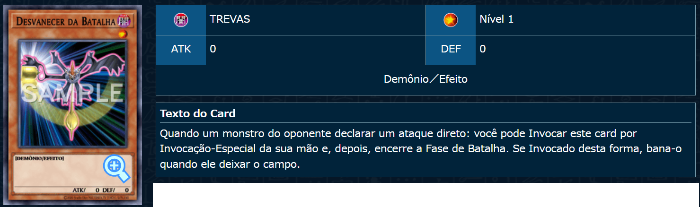

# Repositório de Insertion Sort

## Alunos  
| Matrícula | Nome |  
|-----------------------|---------------------|  
| 21/1029512 | Laís Cecília Soares Paes |  
| 20/2017129 | Rodrigo de Andrade Lima Orlandi |  

## Descrição do projeto
O projeto visa utilizar Insertion Sort em vetores de 40 elementos, parando quando uma das seis condições de parada for escolhida, e demonstrando o vetor resultante.  

## Contexto
Em um belo dia, Yugia teve vontade de jogar Yugioh. Havia apenas um pequeno detalhe: ela não era muito boa no jogo, e continuava perdendo para seus amigos. Ela conseguiria garantir a vitória, se apenas puxasse aquela carta no momento certo..

Então, Yugia teve a brilhante ideia de trapacear. Não tendo muito dinheiro, ela preparou seu baralho com cartas que funcionassem contra o baralho de seus amigos, e antes da partida, iria embaralhar de tal forma que ela sempre puxasse as cartas que queria na sua mão inicial, composta de 5 cartas.

As cartas que Yugia marcou para lutar contra seus oponentes foram duas cópias de *"Impermanência Infinita"*, duas cópias de *"Florescer das Cinzas e Primavera Feliz"* e uma cópia de *"Desvanescer da Batalha"*, as quais foram marcadas respectivamente como A, B e C. Pode-se conferí-las nas figuras 1 a 3, a seguir:


### **Figura 1**: Impermanência Infinita. **Fonte:** [db-yugioh:ii](https://www.db.yugioh-card.com/yugiohdb/card_search.action?ope=2&cid=13631) [[1]](#Referências)
<br></br>

### **Figura 2**: Florescer das Cinzas e Primavera Feliz. **Fonte:** [db-yugioh:ab](https://www.db.yugioh-card.com/yugiohdb/card_search.action?ope=2&cid=12950) [[1]](#Referências)
<br></br>

### **Figura 3**: Desvanescer da Batalha. **Fonte:** [db-yugioh:bf](https://www.db.yugioh-card.com/yugiohdb/card_search.action?ope=2&cid=8617) [[1]](#Referências)
<br></br>

Porém, algo terrível aconteceu: Yugia tromba com você, e derruba todas as cartas no chão. Frustrada, ela ordena você a arrumar o baralho dela, antes que ela possa embaralhá-lo da maneira ideal.

## Input
Ajude Yugia a pegar as cartas, uma a uma, ao digitar uma letra entre D e Z, de 0 a 3 vezes. Ela ficou com duas cópias da carta A, duas da carta B e uma da carta C. Após pegar as cartas, Yugia manda você dizer qual será o próximo oponente dela, após ouvir o nome do qual, irá embaralhar de uma maneira específica. 

| Nome |  Nome do Deck | Cartas Necessárias na Mão |
|------|---------------|---------------------------|    
| Eliana | Exodia      | 1x  "Florescer das Cinzas e Primavera Feliz" [B] |
| Poly | Pot of Greed  | 2x  "Florescer das Cinzas e Primavera Feliz" [B] [B] |
| Toninho | Tenpai     | 1x  "Devaneio da Batalha" [C] |
| Marcos | Marcado     | 1x  "Florescer das Cinzas e Primavera Feliz", 1x "Impermanência Infinita" [B] [A] |
| Kalynne | Kashtira     | 2x "Impermanência Infinita", 1x "Florescer das Cinzas e Primavera Feliz" [A] [A] [B] |
| Trevor | Tryhard      | 2x "Impermanência Infinita", 2x  "Florescer das Cinzas e Primavera Feliz", 1x  "Devaneio da Batalha" [A] [A] [B] [B] [C] |

## Output
O vetor dado será ordenado até o ponto em que Yugia se tornar satisfeita, com o deck preparado para derrotar um oponente em específico.

## Guia de instalação
1. No seu editor de texto com o terminal do Git Bash instalado ou com o próprio Git Bash, baixe o repositório ao rodar o comando:  

```
$ git clone https://github.com/OrlandiRodrigo/Ord_quad---Yugioh.git
```
ou, se desejar baixar com chave SSH: 

```
$ git@github.com:OrlandiRodrigo/Ord_quad---Yugioh.git
```
2. Se não houver, baixe Python pelo site [https://www.python.org/](https://www.python.org/).

### Como executar o projeto

Abra o Powershell pelo seu editor de texto ou pelo próprio programa, navegue até a pasta onde baixou o repositório e digite

```
$ Python3 main.py
```
para executar o programa.

## Capturas de tela
Neste tópico você deve adicionar imagens do funcionamento do projeto.  
 - As imagens devem ser salvas no repositório.
 - Imagens salvas em domínios eternos tendem a ficar indisponíveis e devem ser evitadas.   
## Conclusões
Aqui você diz se o algoritmo utilizado foi útil, se tem limitações, etc.
## Referências
### [1] Base de dados de Yugioh. Acesso em: [https://www.db.yugioh-card.com/yugiohdb/](https://www.db.yugioh-card.com/yugiohdb/). Visitado em 08/09/2025.
